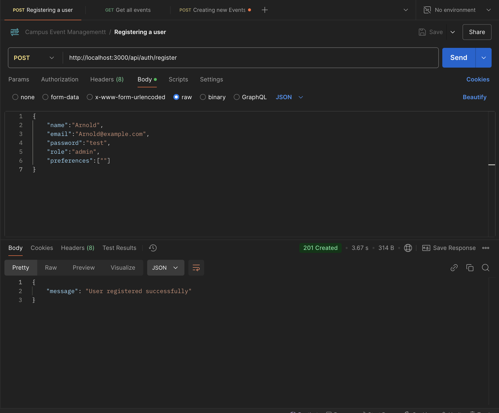
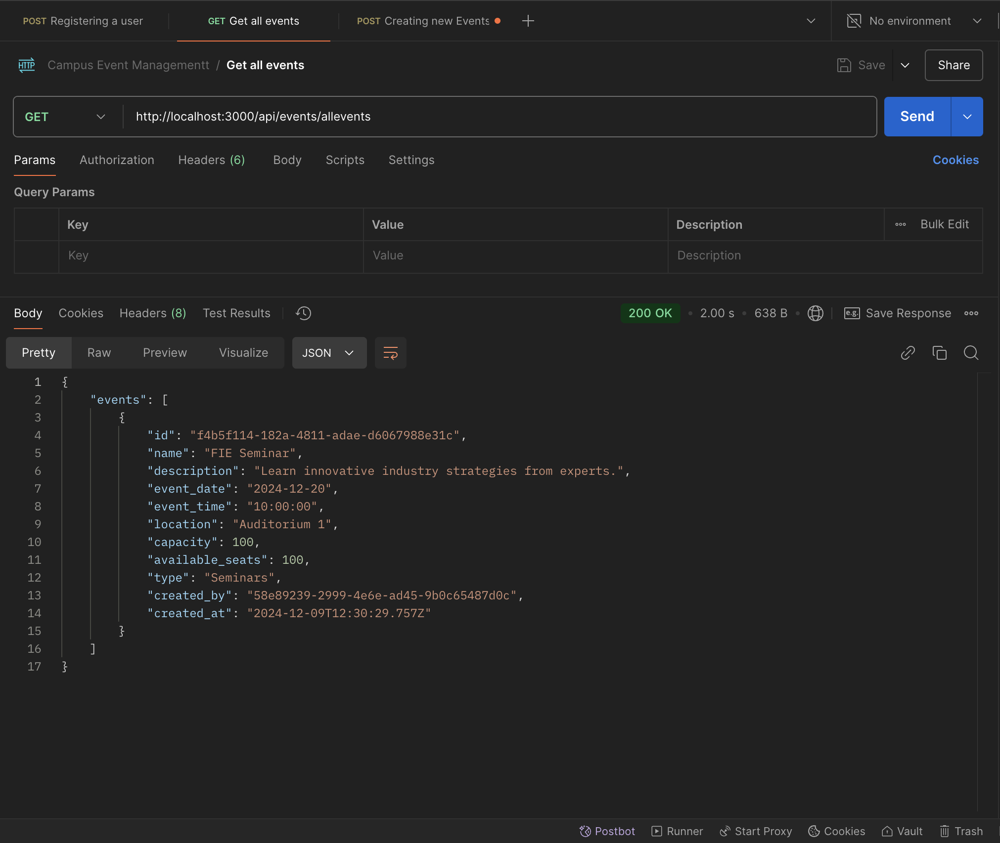
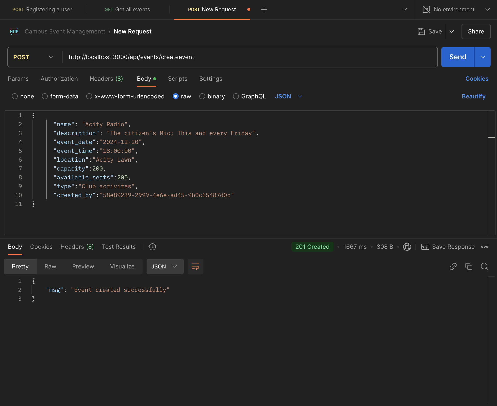

# Campus Event Management Hub (Acity Pulse) - Backend

## Overview

The backend of Acity Pulse is built to support the comprehensive web application designed for managing campus events. It provides RESTful API endpoints for user authentication, event management, and RSVP handling, ensuring secure and efficient data processing and storage.

## Key Features

- **User Authentication**: Secure registration and login system with password hashing.
- **Event Management**: Create, view, and manage campus events with detailed information.
- **RSVP System**: Allows users to register for events and automatically manages seat availability.
- **Database Integration**: Utilizes PostgreSQL for data storage and retrieval.

## Tech Stack

### Backend
- Node.js with Express for server-side logic
- PostgreSQL database for data persistence
- bcryptjs for password hashing
- CORS for cross-origin resource sharing
- Nodemon for development server monitoring

## Getting Started

### Prerequisites
- Node.js (v14 or higher)
- PostgreSQL database
- npm or yarn package manager

### Installation

1. Clone the repository:
   ```bash
   git clone <repository-url>
   ```

2. Navigate to the backend directory:
   ```bash
   cd Backend
   ```

3. Install dependencies:
   ```bash
   npm install
   ```

4. Set up the PostgreSQL database:
   - Ensure your PostgreSQL server is running.
   - Update the connection string in `config/db.js` to match your database credentials.

5. Start the server:
   ```bash
   npm start
   ```

6. The server will be running on `http://localhost:3000`.

## API Endpoints

- **Authentication**
  - `POST /api/auth/register`: Register a new user
  - `POST /api/auth/login`: Login an existing user

- **Events**
  - `GET /api/events/allevents`: Retrieve all events
  - `POST /api/events/createevent`: Create a new event
  - `POST /api/events/confirmrsvp`: Confirm RSVP for an event

## Database Configuration

The backend connects to a PostgreSQL database using a connection string. Ensure the database is set up with the necessary tables for users, events, and RSVPs.

## Contributing

Contributions are welcome! Please fork the repository and submit a pull request for any improvements or bug fixes.

## License

This project is licensed under the ISC License.

## Endpoint Images

The following images illustrate the various API endpoints available in the backend. These images are located in the `endpoint images` folder.

- **Authentication Endpoints**:
  - 
  - 

- **Event Management Endpoints**:
  - 
  - 
  - 
